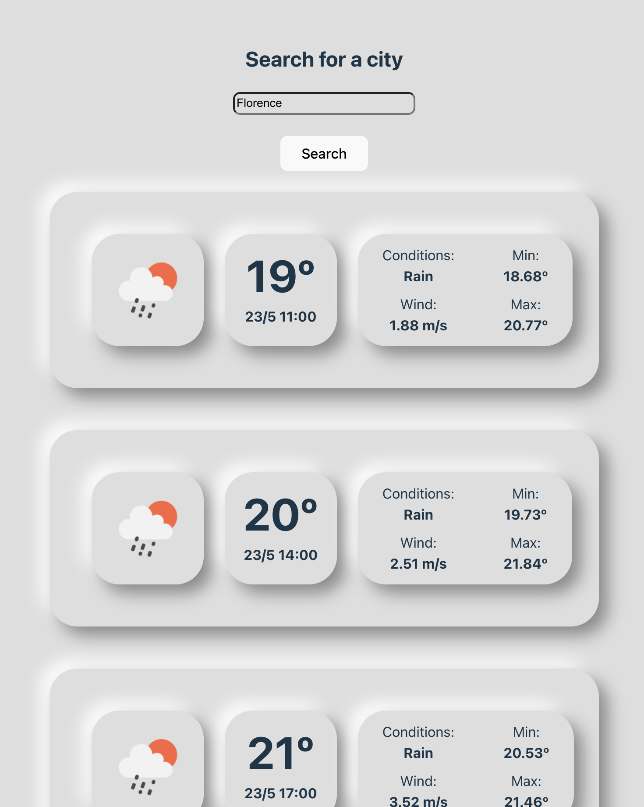

# Weather App

This project utilizes React and the OpenWeatherMap API to fetch weather data based on a location set by the user.

## Preview



## Table of Contents

- [About](#about)
- [Getting Started](#getting-started)
- [Usage](#usage)
- [Technologies](#technologies)
- [License](#license)

## About

The Weather App allows the user to set a location based on an text input, passes this input to the OpenWeatherMap API, and displays the next 5-day forecast for that location.

## Getting Started

To get started with the Weather App, follow these steps:

1. Clone this repository to your local machine:

   ```bash
   git clone https://github.com/imisstheoldpabl0/pabl0-weather-app
   ```

2. Navigate to the project directory:

   ```bash
   cd pabl0-weather-app
   ```
3. Open the repository in your IDE of choice and run it:

    ```bash
   npm run dev
   ```

## Usage

Once the application is loaded, you will see a list of cards that display the weather's information for the next 5 days every 3 hours. By default, this application obtains your current geolocation position and therefore uses your location to display the first list of cards. Input any city in the text field and hit enter to search for that city.


## Technologies

The Earthquake Tracker is built using the following technologies:

- JavaScript
- React
- CSS

## License

This project is licensed under the MIT License.


